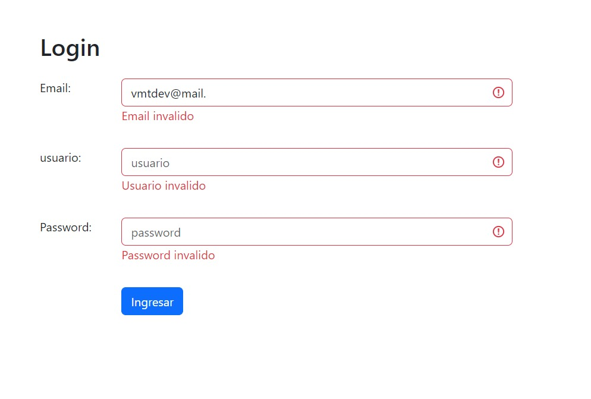
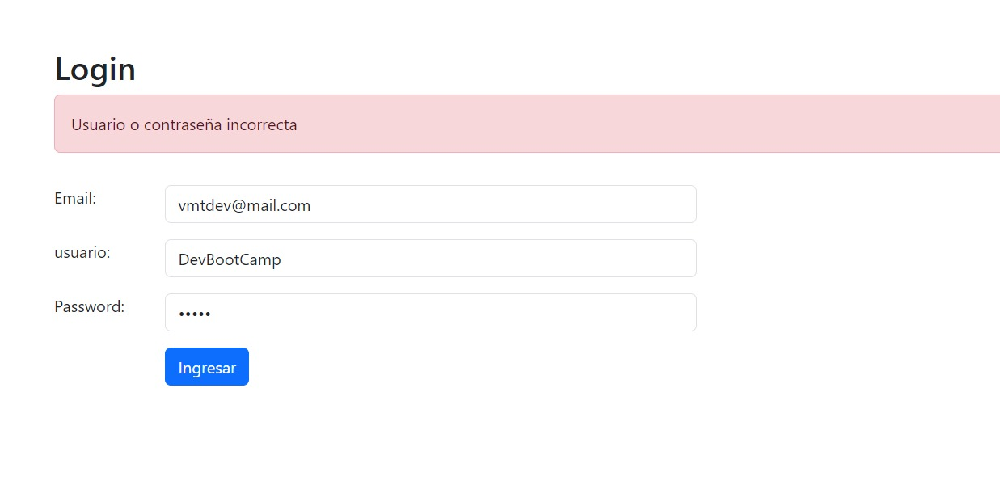
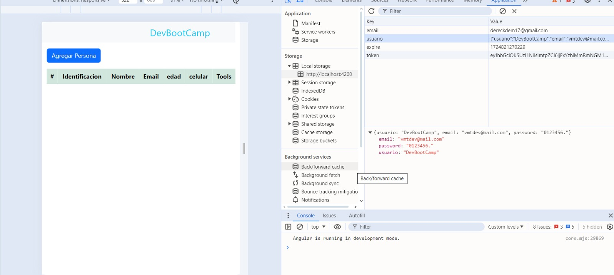
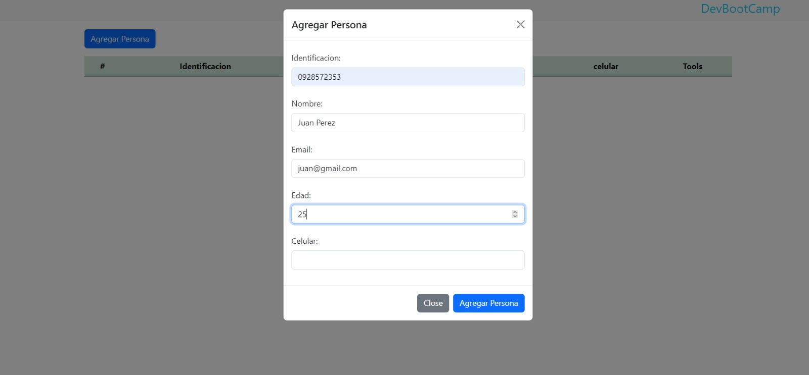
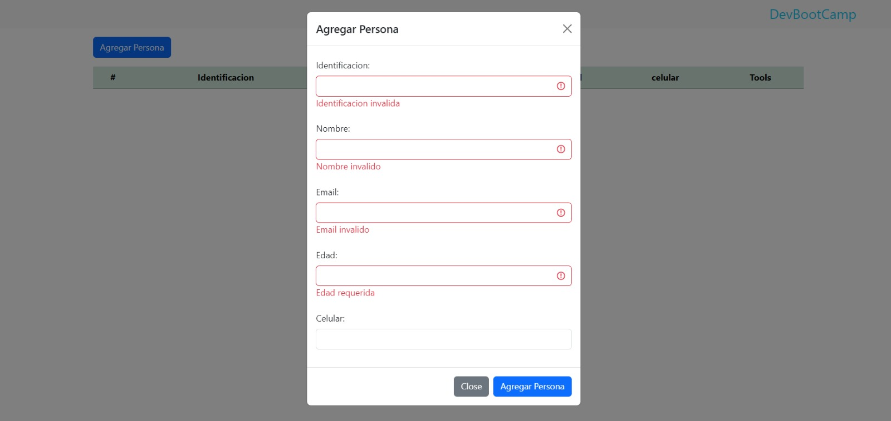
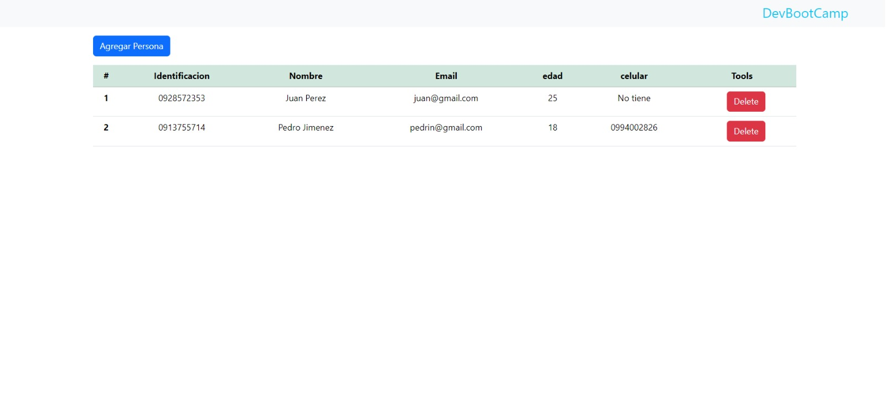

# Practica

This project was generated with [Angular CLI](https://github.com/angular/angular-cli) version 17.3.8.

## Development server

Run `ng serve` for a dev server. Navigate to `http://localhost:4200/`. The application will automatically reload if you change any of the source files.

## Code scaffolding

Run `ng generate component component-name` to generate a new component. You can also use `ng generate directive|pipe|service|class|guard|interface|enum|module`.

## Build

Run `ng build` to build the project. The build artifacts will be stored in the `dist/` directory.

## Running unit tests

Run `ng test` to execute the unit tests via [Karma](https://karma-runner.github.io).

## Running end-to-end tests

Run `ng e2e` to execute the end-to-end tests via a platform of your choice. To use this command, you need to first add a package that implements end-to-end testing capabilities.

## Further help

To get more help on the Angular CLI use `ng help` or go check out the [Angular CLI Overview and Command Reference](https://angular.io/cli) page.
## Integrantes
* Boris Suarez
* Dereck Estrada
### Login
Para las validaciones se uso el reactiveForm, el uso de bootstrap para la parte visual como clases "is-invalid" cuando el usuario no cumple con alguno de las validaciones creadas para ser mas facil el uso de indicacion de los invalids se creo un metodo "getInvalid()" que recibe como parametro el nombre del campo del reactiveForm, en el constructor se ingreso un usuario quemado que nos sirve como referencia para poder ingresar a mostrar un alert en caso de que no se los campos ingresados por el usuario sean distintos a este usuario almacenado, dicho usuario se encuentrara en el localStorage, al ser un json se uso el JSON.stringify, esto nos ayudara a poder hacer que el header de la proxima pantalla indique una pequeña simulacion  del usuario que esta usando el sistema. 
 

### Tabla Personas y Modal Personas

Se uso las plantillas de bootstrap para la creacion de la tabla, se definio una clase para poder acceder a los campos de la personas con mayor facilidad, de la misma forma para evitar que haya data que no se quiere como puede ser los vacios se uso las mismas ideas que en el login para validar cada del Modal, se uso el @OutPut() para poder emitir un evento y que luego se pueda agregar a nuestra tabla, de ser necesario tambien se incluyo un button para poder eliminar a la persona que el usuario desee

